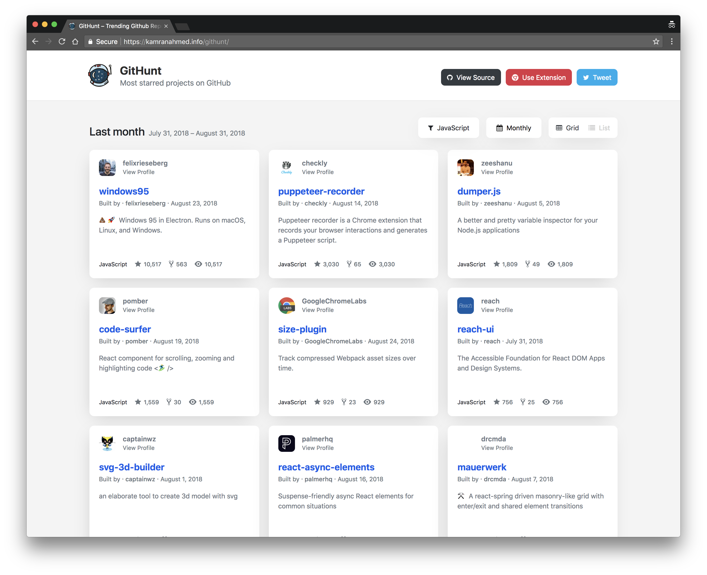

<h1 align="center">
  	   GitHunt
</h1>

  
  
  

  <b>Hunt the most starred projects on GitHub</b> 
  ✨ React app and Chrome Extension to go through the top projects ✨ 

   <b>GitHunt</b> is a react application and a chrome extension that lets you explore
   the most starred projects on GitHub <a href="https://kamranahmed.info/githunt">Use Online</a> • <a href="https://bit.ly/githunt-chrome">Install Extension</a>
    
  <b>Weekly Trending Projects – List View</b> 
  💥 Keep Scrolling to load past weeks 💥

  
  <b>Weekly Trending Projects – Grid View</b> 
  💥 Change the view options from the filters list 💥

  
  <b>Filter by Language</b> 
  💥 Will remember your selection of language 💥

## Installation

* Use Online – https://kamranahmed.info/githunt
* Chrome Extension – https://bit.ly/githunt-chrome

## Contributions

* Spread the word
* Open pull requests
* Reach out with any feedback 

## License
MIT © [Kamran Ahmed](https://kamranahmed.info)
